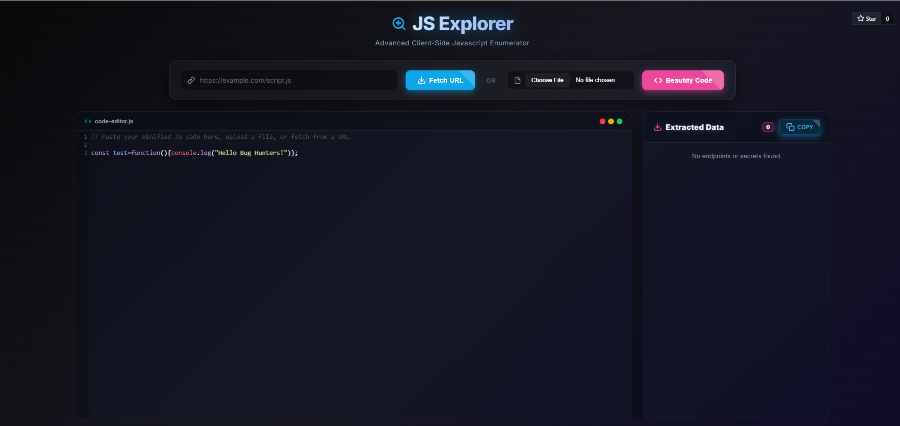

# JS Explorer 🕵️‍♂️🔍

<b>A Client-Side JavaScript Reconnaissance & Analysis Tool</b> 
Built for Bug Bounty Hunters, Penetration Testers, and Security Researchers

---

# Overview

Modern web applications ship **large, minified JavaScript bundles** that often contain valuable reconnaissance data such as hidden API routes, internal services, configuration objects, and embedded credentials.

Manually analyzing these bundles can be time-consuming.

**JS Explorer** is a lightweight **browser-based JavaScript analysis tool** that helps security researchers quickly extract useful information from JavaScript files.

The tool runs **entirely inside the browser**, meaning:

- No backend server
- No data uploads
- No remote processing
- Complete local analysis

This allows researchers to safely analyze **sensitive application code** during bug bounty and penetration testing engagements.

---

# Inspiration

JS Explorer was built after exploring several JavaScript analysis and reconnaissance techniques commonly used in the **bug bounty and security research community**.

While developing this project, I studied approaches used in other open-source tools and combined those ideas with my own experimentation to create a **lightweight browser-based solution**.

The goal was to bring multiple capabilities such as **JavaScript beautification, endpoint discovery, secret detection, and recon data extraction** into a single tool that runs entirely in the browser.

Huge credit goes to the **open-source security community** for the inspiration and knowledge that helped shape this project.

---

Made for the Bug Bounty & Security Research Community

